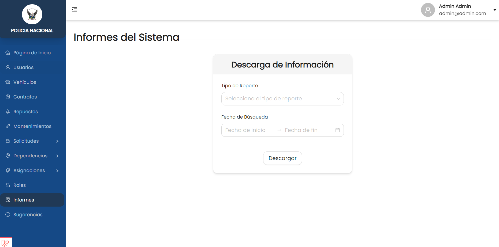

# **SGPN**

---
## **Acerca de**
El **Sistema de Gestión de la Policía Nacional** es una aplicación web que permite la gestión de los vehículos que tiene la policía nacional poder realizar mantenimientos, generar informes, administrar al personal, entre otros.

---
## **Requisitos Previos**
Para poder instalar el proyecto localmente se debe tener en cuenta que se utiliza laravel sail y docket para poder correr el proyecto de forma correcta.
 * Laravel 10
 * PHP 8.2
 * Laravel Sail
 * Docker Desktop
 * Windows WSL2 
 * Visual Studio Code (Opcional) 

---
## **Instalación**
Para poder instalar la app dentro de un ambiente de desarrollo se debe seguir los siguentes pasos:
1. Abrir el terminal de ubuntu en el WSL2.
2. Clonar el proyecto en el terminal.
3. Ingresar al proyecto e instalar las dependencias de laravel sail.
    > composer require laravel/sail --dev
4. Publicar laravel sail en la raiz del proyecto con el siguiente comando.
    > php artisan sail:install
5. Iniciarlizar el proyecto con el siguiente comando.
    > ./vendor/bin/sail up 
6. Generar un alias para sail con el siguiente comando.
    > alias sail='[ -f sail ] && sh sail || sh vendor/bin/sail'
7. Crear una DB y configurar el .env para poder realizar una conexion a la base de datos, con los datos utilizados en las variables de entorno.
8. Instalar las dependencias de Front y Back con los siguientes comando.
    > sail composer install

    > sail npm install
9. Cargar las migraciones y rellenar los datos con los seeders utilizando los siguiente comandos.
    > sail artisan migrate:fresh --seed
10. Encender el proyecto con el siguiente comando.
    > sail npm run dev -- --host

**Nota:**  Para configurar las variables de entorno de manera local, se debe crear un archivo .env en la raiz del proyecto, Se puede basar en el .env.example.

---
## **Variables de entorno**
### **Base de datos**
|Nombre de la variable|           Uso                 |
|---------------------|-------------------------------|
|DB_DATABASE              |Nombre de la base de datos    |
|DB_USERNAME              |Nombre del usuario para hacer conexión      |
|DB_PASSWORD          |Contraseña de la DB            |
|DB_PORT          |Puerto de la conexión           |

**Nota**: Para poder realizar pruebas se debe configurar mailtrap en el .env

---
## **Capturas del sitio**
**Landing Page**

**Registro**

**Página principal**

**Registrar Mantenimiento**

**Mantenimiento**

**Vehículos**

**Informes**
